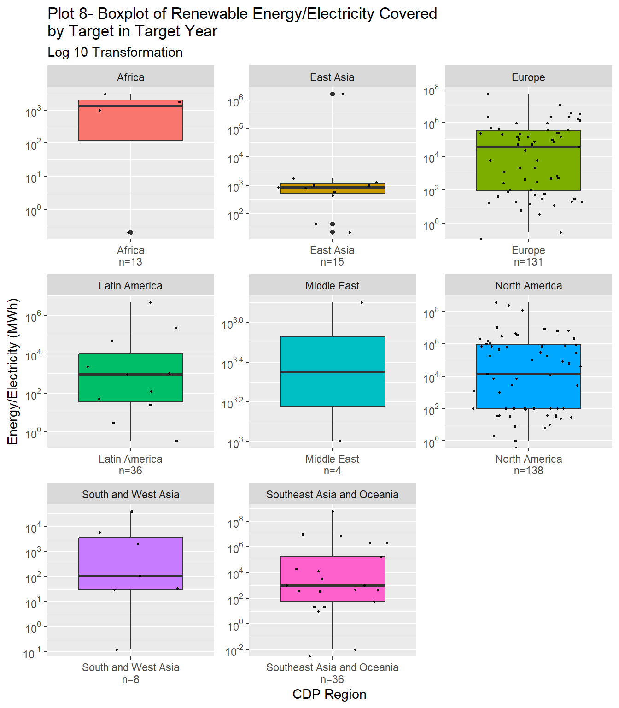

## Exploratory Data Analysis - CDP-ICLEI Report

This data was collected in partnership by CDP and ICLEI - Local Governments for Sustainability.

This dataset contains all data points for all cities reporting publicly in 2019. This is regularly updated automatically and has recent data.

### Primary evaluation of Energy Data 

814 organizations in 93 countries and 8 CDP regions have taken part in this questionnaire. The names of the participating organizations, countries and regions can be viewed in the output (Table 1 & Table 2). The questionnaire is composed of 6 main questions and 5 sub-questions. The questions can be viewed in the output (Table 3). 

## Data Analysis of Energy Trends

The main objective of this analysis is to identify renewable energy key performance indicators (KPIs) and trends for the reporting CDP Regions. 

### Question 8.0 - Does your city have a renewable energy or electricity target?
{width=1152}
In the first question of the questionnaire, it is clear that most organizations in North America and Europe have a renewable energy or electricity target. There is a large gap between North America and Europe with the next region Latin America, followed by Southeast Asia and Oceania, East Asia and Africa, South and West Asia and lastly the Middle East. Out of 814 organizations 151 did not answer this question. 
Plot 1 visualizes and summarizes each region's answer. 

### Question 8.0a - Please provide details of your renewable energy or electricity target(s) and how the city plans to meet those targets. Question dependencies - This question is only relevant if question 8.0 was answered as "Yes"

A total of 295 organizations out of 814 answered that they have renewable energy or electricity target (for 39 organizations no answer was logged). The following plots provide a visualization for a table which includes the response options to question 8.0a.

#### Scale of Implementation
{width=1152}
The majority of the energy targets are set to be implemented in 217 cities compared to 125 local governments and for 9 targets their scale of implementation is not stated. It is important to acknowledge that some organizations have targets for both city-wide and local government operations scale e.g. Ajuntament de Barcelona, Spain. 

#### Energy / Electricity Types Covered by Target   
{width=1152}{width=1152}
Plot 3 describes the type of target the organizations have set for the renewable energy goals.
In total all the CDP Regions have set 334 targets, most of the targets are to change all electricity consumed in $MWh$ and all energy consumed in $MWh$ to renewable energy. Some of the reporting organizations have reported more than one target e.g. Portland, Oregon in North America and Sydney, Australia. Most of the organizations that reported more than one target belong to North America, Europe and Southeast Asia and Oceania.
Map 1 is colored depending on the number of targets set for each CDP Region, North America leads with a total of 132 targets, Europe with 113 targets, Southeast Asia and Oceania with 31 targets, Latin America with 24 targets, East Asia with 21 targets, Africa with 9 targets, South and West Asia with 8 targets and the Middle East with 3 targets. 

#### Base and Target Year for Target Implementation
{width=1152}{width=1152}
Plot 4 describes the number of targets set for each base year reported by organizations and aggregated by CDP Regions. It is clear that organizations based in Europe and North America have started setting targets earlier than the rest of the reporting regions. The last region to set energy and electricity target is the Middle East. 38 out of 287 targets base year was in 2015, 94 organizations did not report their targets base year.

Plot 5 describes what is the implementation deadline year for the number of targets set. 83 out of 317 targets are intended to be implemented until 2020, with the majority of targets set by Europe and North America. 31 targets are intended to be implemented until 2025, 66 are intended to be implemented until 2030 and 29 targets are intended to be implemented until 2050. 

#### Renewable Energy / Electricity Covered by Target in Base Year in units of MW / MWh
{width=672}
Plot 6 consist of boxplots that summarize the distribution of the renewable energy and electricity in $MWh$ covered by target in base year for each CDP Region. The boxplots are displayed using the log 10 transformation to stabilize the variation within CDP Regions.The organizations within the CDP Regions present a wide distribution with some organizations setting very high renewable energy / electricity targets and others low renewable energy / electricity targets.(n=the number of targets) 

{width=1152}

Table: Table 4 - Statistics for Renewable Energy / Electricity Covered by Target in Base Year by CDP Region

|         CDP Region         | Average (MWh) | Standard Deviation (MWh) |  Total (MWh)  | Number of Targets | Ratio out of Total |
|:--------------------------:|:-------------:|:------------------------:|:-------------:|:-----------------:|:------------------:|
|           Africa           |    988.04     |        912.95931         |    4,940.2    |        13         |      0.00001       |
|         East Asia          |  213,410.67   |      508,240.64059       |  2,134,106.7  |        15         |      0.00279       |
|           Europe           | 1,597,372.41  |     10,464,285.02353     | 105,426,579.1 |        131        |      0.13762       |
|       Latin America        |  189,661.22   |      423,199.69542       |  2,844,918.3  |        36         |      0.00371       |
|        Middle East         |     16.00     |         13.34166         |     64.0      |         4         |      0.00000       |
|       North America        | 2,181,625.92  |     11,942,030.75515     | 152,713,814.7 |        138        |      0.19934       |
|    South and West Asia     |   16,996.81   |       29,528.84869       |   118,977.7   |         8         |      0.00016       |
| Southeast Asia and Oceania | 21,862,907.01 |    103,095,050.73041     | 502,846,861.3 |        36         |      0.65638       |

Table: Table 5 - Statistics for Renewable Electricity Covered by Target in Base Year by CDP Region

|         CDP Region         | Average (MWh) | Standard Deviation (MWh) | Total (MWh) | Number of Targets | Ratio out of Total |
|:--------------------------:|:-------------:|:------------------------:|:-----------:|:-----------------:|:------------------:|
|           Africa           |     972.5     |        733.26973         |    1,945    |         6         |      0.00001       |
|         East Asia          |   110,623.2   |      247,070.87722       |   553,116   |         8         |      0.00376       |
|           Europe           |   415,260.0   |     1,317,802.87666      | 12,457,799  |        53         |      0.08479       |
|       Latin America        |      0.0      |            NA            |      0      |         2         |      0.00000       |
|       North America        |  4,061,185.2  |     17,782,831.63973     | 125,896,741 |        52         |      0.85688       |
|    South and West Asia     |      4.5      |         3.53553          |      9      |         3         |      0.00000       |
| Southeast Asia and Oceania |  1,001,842.2  |     2,340,093.42182      |  8,014,737  |         9         |      0.05455       |
Plot 7 presents the total renewable energy and electricity in $MWh$ covered by target in base year aggregated by CDP Region. Table 4 summarizes the statistics for electricity and energy covered by target in base year aggregated by CDP Region. As observed the largest contributor is Southeast Asia and Oceania with ~65% contribution out of the total renewable energy and electricity covered by target of all reporting organizations in base year with 36 targets set. Next is North America with ~19% with 138 targets, followed by Europe with ~13% with 131 targets. Table 5 summarizes the statistics for renewable electricity covered by target in base year aggregated by CDP Region. As observed the largest contributor is North America with ~80% contribution out of the total renewable electricity of all reporting organizations covered by target in base year with 52 targets set. Next is Europe with ~8% with 53 targets, followed by Southeast Asia and Oceania with ~5% with 9 targets. 

#### Renewable Energy / Electricity Covered by Target in Target Year in units of MW / MWh
{width=672}
Plot 8 consist of boxplots that summarize the distribution of the renewable energy and electricity in $MWh$ covered by target in base year for each CDP Region. The boxplots are displayed using the log 10 transformation to stabilize the variation within CDP Regions.The organizations within the CDP Regions present a wide distribution with some organizations setting very high renewable energy / electricity targets and others low renewable energy / electricity targets.(n=the number of targets)

{width=1152}

Table: Table 6 - Statistics for Renewable Energy / Electricity Covered by Target in Target Year by CDP Region

|         CDP Region         | Average (MWh)  | Standard Deviation (MWh) |  Total (MWh)   | Number of Targets | Ratio out of Total |
|:--------------------------:|:--------------:|:------------------------:|:--------------:|:-----------------:|:------------------:|
|           Africa           |   1,452.550    |        1,293.345         |    5,810.20    |        13         |      0.00000       |
|         East Asia          |  147,752.076   |       487,470.448        |  1,625,272.84  |        15         |      0.00107       |
|           Europe           | 1,419,408.384  |      6,718,288.688       | 85,164,503.04  |        131        |      0.05624       |
|       Latin America        |  428,904.032   |      1,331,931.947       |  4,717,944.35  |        36         |      0.00312       |
|        Middle East         |   3,005.000    |        2,821.356         |    6,010.00    |         4         |      0.00000       |
|       North America        | 12,954,007.890 |      57,961,767.731      | 803,148,489.15 |        138        |      0.53038       |
|    South and West Asia     |   6,839.664    |        14,755.937        |   47,877.65    |         8         |      0.00003       |
| Southeast Asia and Oceania | 28,162,673.033 |     127,378,470.070      | 619,578,806.72 |        36         |      0.40915       |

Table: Table 7 - Statistics for Renewable Electricity Covered by Target in Target Year by CDP Region

|         CDP Region         | Average (MWh) | Standard Deviation (MWh) | Total (MWh) | Number of Targets | Ratio out of Total |
|:--------------------------:|:-------------:|:------------------------:|:-----------:|:-----------------:|:------------------:|
|           Africa           |    1,738.0    |            NA            |    1,738    |         6         |      0.00000       |
|         East Asia          |   231,674.3   |       611,105.068        |  1,621,720  |         8         |      0.00198       |
|           Europe           |   456,151.9   |      2,047,702.412       | 14,596,861  |        53         |      0.01778       |
|       Latin America        |      NaN      |            NA            |      0      |         2         |      0.00000       |
|       North America        | 25,350,014.0  |      80,689,648.768      | 785,850,435 |        52         |      0.95707       |
|    South and West Asia     |    1,052.5    |        1,339.967         |    2,105    |         3         |      0.00000       |
| Southeast Asia and Oceania |  2,378,005.1  |      3,923,048.882       | 19,024,041  |         9         |      0.02317       |

Plot 9 presents the total renewable energy and electricity in $MWh$ covered by target in target year aggregated by CDP Region. Table 6 summarizes the statistics for renewable electricity and energy covered by target in target year aggregated by CDP Region. As observed the largest contributor is North America with ~53% contribution out of the total energy and electricity covered by target in target year with 138 targets Next is Southeast Asia and Oceania with ~40% with 36 targets, followed by Europe with ~5% with 131 targets. The total renewable energy and electricity for all the reporting organizations in the target years is estimated to be 1,514,294,714 $MWh$ compared to 766,090,262 $MWh$ in the base years. This means that if the targets are achieved the renewable energy and electricity resources will grow by 748,204,452 $MWh$ this is almost double renewable energy and electricity than what is reported in the base years. Table 7 summarizes the statistics for renewable electricity covered by target in target year aggregated by CDP Region. As observed the largest contributor is North America with ~95% contribution out of the total renewable electricity covered by target in target year with 52 targets Next is Southeast Asia and Oceania with ~2% with 9 targets, followed by Europe with ~2% with 53 targets. The total renewable electricity for all the reporting organizations in the target years is estimated to be 821,096,899 $MWh$ compared to 146,924,348 $MWh$ in the base years. This means that if the targets are achieved the renewable electricity resources will grow by 674,172,551 $MWh$ by the last target year 2050.

#### Percentage of Renewable Energy / Electricity of Total Energy or Electricity in Base Year
{width=1152}
In order to calculate the total energy for each region the following formula is used $E(t)=Re(t)/Re\%$, when $E(t)$ is total energy in $MWh$, $Re(t)$ is total renewable energy and in $MWh$ and $Re\%$ is the percentage of renewable energy. Plot 10 shows that South and West Asia has the highest percentage of renewable energy out of the total energy used in the targets set for their base years. 

#### Percentage of Renewable Energy / Electricity of Total Energy or Electricity in Target Year
{width=1152}
To calculate the percentage of the renewable energy out of total energy the same equation was used as for Plot 10.
Plot 11 presents that North America and South and West Asia have the highest percentage of renewable energy out of the total energy used in the targets set for their target years, with North America aiming to achieve almost 100% renewable energy. Compared to the base years all regions plan to have a higher percentage of renewable energy out of their total energy consumption.

### Question 8.0b - Please Explain Why You Do Not Have a Renewable Energy or Electricity Target and Any Plans to Introduce One in the Future.

This question is answered if an organization selected “Not intending to undertake” or “Intending to undertake” in response to question 8.0.  
{width=1152}
In plot 12, 162 organizations reported different reasons to why they do not have a renewable energy or electricity target. 52 organizations answered that they already have a target under development or consideration, 29 stated that the grid is not controlled by the city, 21 mentioned the reason is due to lack of funding, 18 said the reason is that the energy / electricity is not within the city jurisdiction, 8 stated that there is a lack of renewable energy potential within the city, 7 said that renewable energy is currently not prioritized, 2 said that their target has been achieved, 13 gave different reasons, and 12 did not have their answer reported.  

### Question 8.1 - Please Indicate the Source Mix of Electricity Consumed in your City
{width=1152}
Plot 13 describes the percentage of each energy source out of all the electricity mix used in every CDP Region. The values are based on answers from 272 organizations and aggregated by CDP Region.

### Question 8.2 - What Scale is the Electricity Mix Data Reported Above?
-1.png){width=1152}
Plot 14 describes 272 organizations reporting regarding the scale of the energy sources of the electricity mix presented in Plot 13. 106 organizations reported that this is a city-wide energy mix and 71 reported that this is a national energy mix. In North America many organizations reported about a different scale, most stated that it is a state or provincial energy mix. 

### Question 8.4 - How Much (in MW capacity) Renewable Energy is Installed Within the City Boundary in the Following Categories?
{width=1152}
Plot 15 describes out of the total percentage of renewable energy, how much of the following sources is used in each CDP Region. The sources are wind, solar thermal, solar photovoltaic (PV), renewable district heat/cooling, ground or water sources and other where the organizations specify the source they use.  In Latin America Brazil reported a large amount of renewable energy under the other category but with no specification of what kind of renewable energy source they use. 

### Question 8.5 - Does Your City Have a Target to Increase Energy Efficiency?
{width=1152}
In plot 16, 200 organizations out of 598 reported that they have a target to increase their energy efficiency. 167 stated that they have a target in progress, 108 are intending to undertake in the next 2 years, 80 organizations reported that they do not know, and 43 are not intending to undertake energy efficiency targets.
  
### Question 8.5a - Please provide details on your city’s energy efficiency targets.
This question only applies to the organization that stated that they have a target to increase their energy efficiency.

#### Scale of Target to Increase Energy Efficiency
{width=1152}
The majority of the energy efficency targets are set to be implemented in 117 cities compared to 93 local governments and for 36 targets there is no stated scale of implementation. It is important to acknowledge that some organizations have targets for both city-wide and local government operations scale e.g. City of Cape Town, South Africa.

#### Energy Efficiency Type Covered by Target
{width=1152}{width=1152}
Plot 18 describes the type of target the organizations have set for their energy efficency goals.
In total all the CDP Regions have set 204 targets, most of the targets are to reduce all energy consumed in $MWh$. Some of the reporting organizations have reported more than one target e.g. Lisbon, Portugal and Tokyo, Japan. Most of the organizations that reported more than one target belong to North America, Europe and Southeast Asia and Oceania. Some targets that were stated as other include reducing $CO_{2}$ emissions and reducing energy consumption of buildings. 
Map 2 is colored depending on the number of energy efficiency targets set for each CDP Region, Europe leads with a total of 68 targets, North America with 62 targets, Latin America with 23 targets, Africa with 21 targets, Southeast Asia and Oceania with 17 targets, East Asia with 8 targets, South and West Asia with 4 targets and the Middle East with 1 target. 

#### Base and Target Year for Energy Efficiency Targets
{width=1152}{width=1152}
Plot 19 describes the number of targets set for each base year reported by organizations and aggregated by CDP Regions. It is clear that organizations based in Europe and North America have started setting targets earlier than the rest of the reporting regions. The last region to set energy and electricity target is the Middle East. 26 out of 191 targets base year was in 2016, 55 organizations did not report their targets base year.

Plot 20 describes what is the implementation deadline year for the targets set. 54 out of 177 targets are intended to be implemented until 2020, with the majority of targets set by Europe. 35 out of 177 targets are intended to be implemented until 2030, 21  targets are intended to be implemented until 2025 and 20 targets are intended to be implemented until 2050. 

#### Total Energy Consumed/Produced Covered by Target in Base Year 
{width=672}
Plot 21 consist of boxplots that summarize the distribution of the energy consumed or produced in $MWh$ covered by target in base year for each CDP Region. The boxplots are displayed using the log 10 transformation to stabilize the variation within CDP Regions.The organizations within the CDP Regions present a wide distribution with some organizations setting very high renewable energy / electricity targets and others low renewable energy / electricity targets. The organizations from the Middle East are not displayed because no data was available.(n=the number of targets) 

Table: Table 8 - Statistics for Energy Consumed/Produced Covered by Target in Base Year

|         CDP Region         | Average (MWh) | Standard Deviation (MWh) |  Total (MWh)   | Number of Targets | Ratio out of Total |
|:--------------------------:|:-------------:|:------------------------:|:--------------:|:-----------------:|:------------------:|
|           Africa           |   5,676,260   |        9,409,081         |   85,143,901   |        22         |      0.00172       |
|         East Asia          | 6,671,767,410 |      16,229,693,910      | 40,030,604,463 |        10         |      0.80989       |
|           Europe           |   3,019,389   |        6,098,435         |  126,814,322   |        79         |      0.00257       |
|       Latin America        |  17,960,351   |        42,280,958        |  215,524,211   |        28         |      0.00436       |
|        Middle East         |      NaN      |            NA            |       0        |         1         |      0.00000       |
|       North America        |  184,086,567  |       777,931,003        | 8,467,982,100  |        78         |      0.17132       |
|    South and West Asia     |   1,208,657   |        2,093,144         |   3,625,971    |         7         |      0.00007       |
| Southeast Asia and Oceania |  33,177,381   |       127,691,173        |  497,660,711   |        21         |      0.01007       |
Table 8 summarizes the statistics for electricity and energy covered by target in target year aggregated by CDP Region. As observed the largest contributor is East Asia with ~80% contribution out of the total energy consumed or produced covered by target in base year with 10 targets Next is North America with ~17% with 78 targets, followed by Southeast Asia and Oceania with ~1% with 21 targets.

#### Total Energy Consumed/Produced Covered by Target in Target Year 
{width=672}
Plot 22 consist of boxplots that summarize the distribution of the energy consumed or produced in $MWh$ covered by target in target year for each CDP Region. The boxplots are displayed using the log 10 transformation to stabilize the variation within CDP Regions.The organizations within the CDP Regions present a wide distribution with some organizations setting very high renewable energy / electricity targets and others low renewable energy / electricity targets. The organizations from the Middle East are not displayed because no data was available.(n=the number of targets)

Table: Table 9 - Statistics for Energy Consumed/Produced Covered by Target in Target Year

|         CDP Region         |  Average (MWh)   | Standard Deviation (MWh) |   Total (MWh)    | Number of Targets | Ratio out of Total |
|:--------------------------:|:----------------:|:------------------------:|:----------------:|:-----------------:|:------------------:|
|           Africa           |   8,125,534.89   |        12,210,083        |  121,883,023.4   |        22         |      0.00300       |
|         East Asia          | 5,593,926,265.27 |      13,632,044,484      | 33,563,557,591.6 |        10         |      0.82611       |
|           Europe           |   1,675,374.01   |        4,125,256         |   63,664,212.3   |        79         |      0.00157       |
|       Latin America        |  23,233,362.83   |        48,235,081        |  232,333,628.3   |        28         |      0.00572       |
|        Middle East         |       NaN        |            NA            |       0.0        |         1         |      0.00000       |
|       North America        |  138,849,646.68  |       557,389,037        | 5,831,685,160.4  |        78         |      0.14354       |
|    South and West Asia     |    64,484.57     |         111,367          |    193,453.7     |         7         |      0.00000       |
| Southeast Asia and Oceania |  67,906,388.66   |       178,224,537        |  814,876,663.9   |        21         |      0.02006       |
Table 9 summarizes the statistics for energy consumed or produced covered by target in target year aggregated by CDP Region. As observed the largest contributor is East Asia with ~82% contribution out of the total energy consumed or produced covered by target in target year with 10 targets. Next is North America with ~14% with 78 targets, followed by Southeast Asia and Oceania with ~2% with 21 targets. The total energy consumed or produced for all the reporting organizations in the target years is estimated to be 40,628,193,734 $MWh$ compared to 49,427,355,680 $MWh$ in the base years. This means that if the targets are achieved the energy consumption and production will decline by 8,799,161,946 $MWh$.

#### Please Indicate to Which Energy Sector(s) the Target Applies (Multiple choice)
 the target applies-1.png)<!-- -->
Plot 23 displays in which energy sectors the energy efficiency targets are aimed at. This questions was a multiple choice question, meaning that one target may apply to many different sectors.

### Question 8.5b - Please explain why you do not have an energy efficiency target and any plans to introduce one in the future.

This question only appears if the organization selected “Not intending to undertake” or “Intending to undertake” in response to question 8.5.
<!-- -->
In plot 24, 138 organizations reported different reasons to why they do not have an energy efficiency target. 53 organizations answered that they already have a target under development or consideration, 21 stated that the grid is not controlled by the city, 18 mentioned the reason is due to lack of funding, 14 said the reason is that the energy / electricity is not within the city jurisdiction, 4 stated that there is a lack of renewable energy potential within the city, 2 said that renewable energy is currently not prioritized, 1 stated that the target has been achieved, 25 gave different reasons, and 13 did not have their answer reported.

***

### Conclusions

* Organizations based in North America and Europe have reported more about their renewable energy and energy efficiency targets and plans to meet these targets.
* Southeast Asia and Oceania have set less targets compared to North America and Europe but plan to have a larger percentage of renewable energy out of all their energy.
* If the renewable electricity targets are achieved by 2050 (the last target year), the renewable electricity resources will grow by 674,172,551 $MWh$.
* If the renewable energy and electricity targets are achieved by 2050 (the last target year), the renewable energy resources will grow by almost double the renewable energy that was reported in the base years.
* If the efficiency targets are achieved by 2050 (the last target year), the energy consumption and production of all reporting organizations will decline by 8,799,161,946 $MWh$.

*It is important to acknowledge that for part of the answers and organizations data is not available, this may affect the analysis conclusions*

***

### References
* CDP cities and regions data. Retrieved 2 October 2020, from <https://data.cdp.net/>
* Energy Efficiency | EESI - Environmental and Energy Study Institute. Retrieved 2 October 2020, from <https://www.eesi.org/topics/energy-efficiency/description>
* Shinn, L. (2018). Renewable Energy: The Clean Facts. Retrieved 2 October 2020, from <https://www.nrdc.org/stories/renewable-energy-clean-facts>

